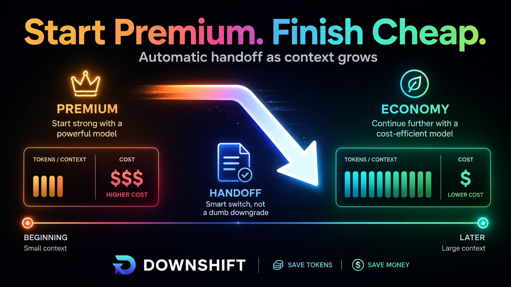

# 🕹️ Downshift

**Start premium. Finish cheap.** Downshift cuts long Pi Coding Agent session costs by switching from your premium model to an economy model when context gets expensive.

Downshift is not a model router.
It does one thing: **start strong, preserve context, then downshift when context pressure crosses a threshold.**

**Subagents can be useful, but they often pay a context tax.** Downshift takes the opposite path: keep the working context, write a handoff note, then make continuation cheaper.

<p align="center">
  
</p>

## Why 💸

Long coding-agent sessions get increasingly expensive.

As the conversation grows, each new turn carries more accumulated context. That means the marginal cost of continuing on a premium model keeps rising, even when the hard planning work may already be done.

Downshift is built around a simple idea:

> Use the premium model while the task is ambiguous, the architecture is being discovered, and the plan is still forming. Once the direction is pinned down and the session context is large, switch to an economy model for cheaper execution.

The premium model creates the working context.
The economy model continues from it.

The idea is not only to save tokens. It is to front-load quality: the premium model establishes intent, direction, decisions, constraints, and working habits while the task is still uncertain. The economy model then inherits that context and continues the work at lower cost.

## Handoff note 📝

When context pressure crosses the threshold, Downshift can ask the premium model to write a concise handoff note before switching to the economy model.

If the agent is already running, Downshift uses Pi steering so the handoff is delivered at the next safe interruption point instead of waiting for the entire task to finish. After the handoff note is written, Downshift switches to the configured economy model and queues a continuation message so the economy model can resume the original work.

This note becomes normal conversation context. It gives the economy model the current goal, decisions, relevant files, remaining steps, constraints, and tests.

The handoff request itself is also sent as a normal user message so the resulting assistant note becomes durable conversation context.

This keeps Downshift simple: premium handles orientation, economy handles continuation.

## What it does ✅

- Starts sessions on a premium model, or captures the current model as premium
- Watches Pi's context usage
- Asks the premium model for a compact handoff note before switching
- Switches to a configured economy model after a token or percent threshold
- Supports token thresholds, percent thresholds, or both
- Remembers whether the session is premium, economy, paused, or mid-handoff
- Pauses automatically after manual model changes
- Optionally switches back to premium after compaction
- Shows a compact status indicator in the UI
- Provides simple `/downshift` commands

## What it is not 🚫

Downshift does not classify prompts.
It does not benchmark models.
It does not run complex routing rules.
It does not try to be clever.

It is a deterministic context-cost governor.

## Install 📦

```bash
pi install npm:pi-downshift
```

Then reload Pi:

```text
/reload
```

## Configure ⚙️

Run:

```text
/downshift
```

If no config exists yet, Downshift launches the guided setup using safe defaults for opt-in behavior and thresholds. After that, the command opens a small menu showing the current values so you can edit individual settings. The config menu title includes the installed Downshift version.

## Commands ⌨️

```text
/downshift
/downshift status
/downshift now
/downshift on
/downshift off
/downshift help
```

### `/downshift`

Opens the interactive config menu. Existing configs can be edited one setting at a time without reselecting everything. On first setup, Downshift runs a guided setup flow.

### `/downshift status`

Shows the current mode, context usage, remaining threshold budget, premium target, economy target, installed version, and last error if paused.

### `/downshift now`

Starts the same handoff immediately, regardless of the configured threshold.

### `/downshift off`

Disables Downshift for the current session.

### `/downshift on`

Re-enables Downshift for the current session.

### `/downshift help`

Shows the available Downshift commands and the installed version.

## Example config 🧩

Downshift stores its config in Pi's agent directory as `downshift.json`.

```json
{
  "enabled": true,
  "threshold": {
    "tokens": 100000,
    "percent": 50
  },
  "economy": {
    "provider": "openai-codex",
    "model": "gpt-5.4-mini",
    "thinkingLevel": "high"
  },
  "premiumSource": "explicit",
  "premium": {
    "provider": "openai-codex",
    "model": "gpt-5.5",
    "thinkingLevel": "medium"
  },
  "startOnPremium": true,
  "upshiftAfterCompaction": false,
  "handoffBeforeDownshift": true
}
```

## Mental model 🧠

A coding session often has two phases:

1. **Orientation**
   The task is unclear. The model needs to inspect files, infer intent, make architectural decisions, and create a plan. Premium models are usually worth it here.

2. **Execution**
   The plan is visible in the context. The relevant files, constraints, and next steps are already known. Economy models can often continue effectively at lower cost.

Downshift automates that handoff with a threshold.

## Downshift vs subagents 🧵

Subagents split work across more conversations. Downshift keeps one conversation moving and changes the model that continues it.

Subagents are useful when parallelism, specialization, or independent review matters. But they also introduce a context tax: each worker needs enough project state to act safely, which can mean re-reading files, rediscovering assumptions, and merging summaries back into the main thread.

For small to medium coding tasks, that coordination overhead can cost more than it saves.

Downshift makes a different bet:

> Keep the working context. Lower the cost of continuing.

The premium model handles orientation, discovery, planning, and architectural judgment. The economy model continues from the accumulated conversation and optional handoff note, without reconstructing the task from scratch.

Downshift is not anti-subagent. It is anti-unnecessary-context-reconstruction.

Use subagents when parallelism matters.
Use Downshift when continuity and cost efficiency matter.

## Prompt caching 💾

Downshift works best with providers that support prompt caching. The premium model creates the shared conversation context, then the economy model continues from that same context after the threshold is reached.

Prompt caching can reduce the cost of repeatedly sending that accumulated context, while Downshift reduces the cost of future generation by moving execution to a cheaper model. The two optimizations are complementary: caching helps pay less for the context you must keep, and Downshift helps pay less for the work that remains.

## Status indicator 📊

Downshift adds a compact status label:

```text
⇣ 42k | 18% → eco
```

This means Downshift is active and will switch to the economy model when the configured context threshold is reached.

Other states:

```text
⇣ handoff
⇣ writing handoff
⇣ eco
⇣ paused
⇣ off
```

## Safety behavior 🛟

Downshift pauses instead of guessing when something changes unexpectedly.

It pauses when:

- The configured model cannot be found
- The selected thinking level is unsupported
- The target provider has no available API key
- You manually change models during the session

This keeps model switching explicit and predictable.

## Why not use a router? 🧭

Routers are useful when you want per-prompt model selection.

Downshift is for a narrower case:

> I already know which model I want to start with, and I already know which cheaper model I want to fall back to once the session gets large.

That narrower scope makes Downshift easier to reason about, easier to configure, and less surprising during long coding sessions.

## Changelog 🗒️

Release notes are generated from Conventional Commits.

See [GitHub Releases](https://github.com/boadij/pi-downshift/releases) or [CHANGELOG.md](https://github.com/boadij/pi-downshift/blob/main/CHANGELOG.md).

## Local development 🛠️

Run the checks:

```bash
npm run check
```

Test locally without publishing:

```bash
pi -e .
```

Or install from the local package path:

```bash
pi install .
```

Then reload Pi:

```text
/reload
```

## License 📄

Apache-2.0
